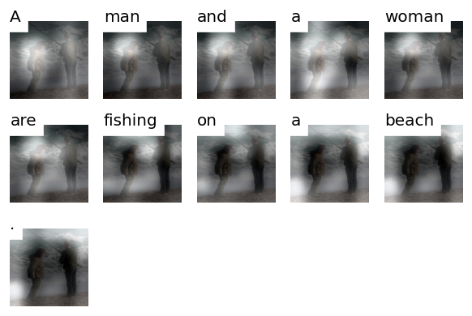

# Image Captioning
This repository is created for the class project of [Visual Media (AY2020)](https://www.hal.t.u-tokyo.ac.jp/~yamasaki/lecture/index.html) in the University of Tokyo.

This repository contains the implementation of several image caption generation algorithms and discussions about them.

* [Show and Tell: A Neural Image Caption Generator (CVPR 2015)](https://arxiv.org/abs/1502.03044)
* [Show, Attend and Tell: Neural Image Caption Generation with Visual Attention (PMLR 2015)](https://arxiv.org/abs/1502.03044)
* [Self-critical Sequence Training for Image Captioning (CVPR 2016)](https://arxiv.org/abs/1612.00563)

## What is this?
### Image Captioning
Image captioning is an interesting task since it requires bringing together two challenging technologies from different disciplines: image understanding and natural language generation. ["Show and Tell"](https://arxiv.org/abs/1502.03044) is the first work that utilized neural network to solve this task. Neural network is very flexible in its architecture, which has enabled to easily unify multi-modal data such as images and texts.

["Show, Attend and Tell"](https://arxiv.org/abs/1502.03044) incorporated the attention mechanism into the neural image caption model. The attention mechanism enables the model to focus on a specific part of the input at each time step of information processing and reduces the burden of summarizing all the input information into a fixed-sized vector, which was common before the advent of the attention.

### Sequence-level Training
The main purpose of this project is to see if the sequence-level training technique with reinforcement learning improves the performance.

Usually, neural sequence generation models are trained with the maximum likelihood objective with the cross-entropy loss, which is, give the whole sequence of the correct answer, to force the model to predict the correct token at each time step. This approach is called [Teacher-Forcing](https://arxiv.org/abs/1506.03099).

However, Teacher-Forcing creates a discrepancy between training and testing: at training time, the correct tokens are feed into the decoder regardless of what has been generated, while at testing time, once the decoder generates an incorrect token, the error will be propagated and the future words conditioned on this one will be incorrect as well. This is called exposure bias.

One approach to address this problem is sequence-level training. This approach incorporates techniques from Reinforcement Learning, and enables directly optimizing sequence-based test metrics as reward. ["Self-critical Sequence Training for Image Captioning"](https://arxiv.org/abs/1612.00563) proposes a technique for sequence-level training called *self-critical sequence training*, where they use the reward for the model output with greedy decoding as the baseline in [the REINFORCE algorithm](https://link.springer.com/article/10.1007/BF00992696). Their approach is shown to be effective and general enough to apply to other sequence generation tasks such as machine translation.

## Usage
### Environment
The python packages are managed by [poetry](https://python-poetry.org/).
Install poetry and then run `poetry install`.

### Data preparation
There are a couple of standard benchmarks for image captioning:
* [flickr8k](https://academictorrents.com/details/9dea07ba660a722ae1008c4c8afdd303b6f6e53b)
* [flickr30k](http://shannon.cs.illinois.edu/DenotationGraph/)
* [MS COCO](https://cocodataset.org/#home)

This repository currently only contains the preprocessing codes and results for flickr8k and flickr30k.

### Converting Images to Feature
First, please run the following command to extract image features from raw images. `IMAGE_DIRECTORY` is the directory that contains all the images in the dataset, and `OUTPUT_DIRECTORY` is the directory to save the resulting files. If you have GPU, you can use that by the option `--device cuda:0`.

```bash
# for reproducing "Show and tell" (feature size [512, 7, 7])
python extract_image_features.py IMAGE_DIRECTORY OUTPUT_DIRECTORY --pretrained-num-layers 31  
# for reproducing "Show, attend and tell" (feature size [512, 14, 14])
python extract_image_features.py IMAGE_DIRECTORY OUTPUT_DIRECTORY --pretrained-num-layers 24  
```

After running this code, you will see the two files under the `OUTPUT_DIRECTORY`, which are the feature vectors serialized in `npy` format (e.g., `vgg16_layer24.npy`) and the original image file names that correspond to the npy file.

Note that in the default config files, we use the image feature extracted from the 31st layer for both the show-and-tell and show-attend-and-tell model (for the show-attend-and-tell model, the 24th layer is used in the original paper). This is because we want to compare different models with the same condition, and we found the 31st layer feature performs better on flickr8k. 

### Writing your own config files
The model and training codes are based on [`allennlp`](https://github.com/allenai/allennlp).
To reproduce the result described below, rewrite data paths in `experiments/flickr/config_base.libsonnet`. 


### Run experiments
Run the following command.
(The best config settings are obtained by running grid search of hyperparameters.)
```bash
# for reproducing "Show and tell"
python train.py experiments/flickr/show_tell_rnn_best.json
# for reproducing "Show, attend and tell"
python train.py experiments/flickr/show_attend_rnn_best.json
```

The reults will be saved under `results/flickr/show_tell_rnn_best/default` and `results/flickr/show_attend_rnn_best/default` respectively.

Due to the low sample efficiency of the REINFORCE algorithm, it is unpractical to use the sequence-level training to train the model from scratch. Therefore, we use the sequence-level training for fine-tuning the best model of the above models. 
```bash
python train.py experiments/flickr/show_attend_rnn_reinforce_best.json
```

### Results
We evaluate the models with BLEU4.

#### Flickr8k
| model                             | best_validation_bleu | test_bleu |
| :---:                             |                 ---: | ---:      |
| Show and Tell                     | 17.3                 | 16.6      |
| Show, Attend and Tell             | 19.7                 | 19.9      |
| Show, Attend and Tell + fine-tune | 20.6                 | 20.4      |

#### Flickr30k
| model                             | best_validation_bleu | test_bleu |
| :---:                             |                 ---: | ---:      |
| Show and Tell                     | 18.2                 | 17.1      |
| Show, Attend and Tell             | 20.9                 | 19.7      |
| Show, Attend and Tell + fine-tune | 22.3                 | 21.8      |

Reproducing ML experiments is notoriously difficult. Although the random seeds are set fixed, we observe that using different GPUs results in different results. 

#### Example


Here's an cherry-picked example of the model's output. The model is the show-attend-and-tell model trained on flickr30k and the image is taken from the validation split.

We can see the model attends to a part of the image relevant to the current output word (it seems to weirdly attend to the same person twice though). You can visualize the model's attention like this in `visualize_attention.ipynb`.